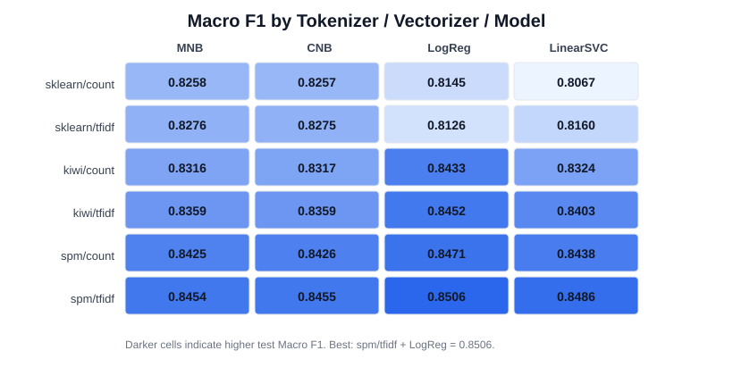
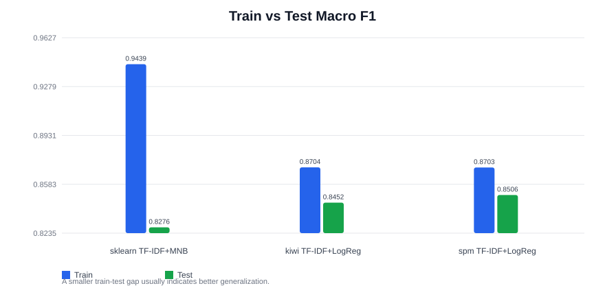
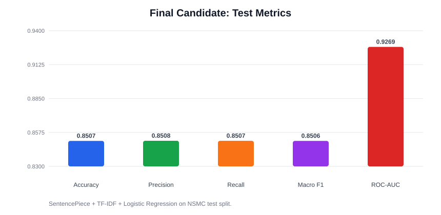
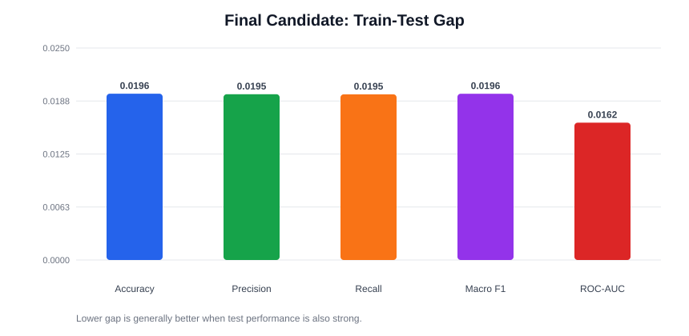
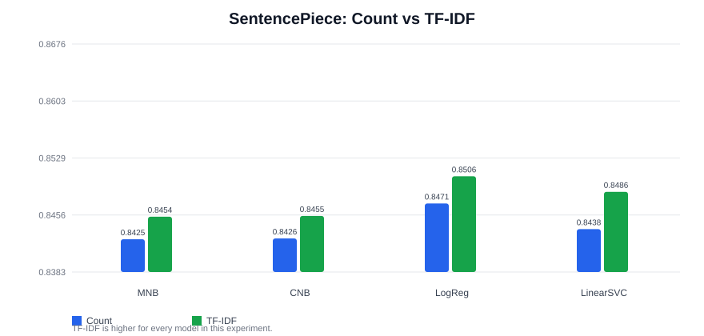
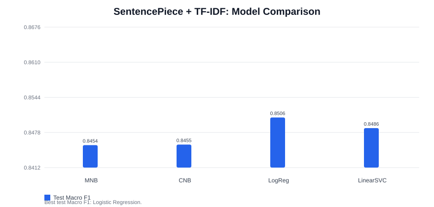

# NSMC 모델 선택 시각화 리포트

## 목적

이 문서는 NSMC 감성분석 실험 결과를 보고 최종 서비스 후보 모델을 선택하기 위한 리포트다.

단순히 “어떤 조합이 1등이었는가”만 정리하지 않는다. 발표나 면접에서 설명할 수 있도록 다음 질문에 답하는 것을 목표로 한다.

```text
1. 왜 Accuracy만 보지 않았는가
2. Precision, Recall, F1, ROC-AUC는 각각 무엇을 의미하는가
3. 왜 Macro F1을 주 선택 기준으로 삼았는가
4. 일반화 성능은 어떤 근거로 판단했는가
5. 현재 결과에서 어떤 모델 조합을 서비스 후보로 가져갈 수 있는가
```

그래프 안의 라벨은 인코딩 깨짐을 줄이기 위해 영어 약어로 표시했다. 한글 해석은 Markdown 본문에서 설명한다.

```text
MNB: Multinomial Naive Bayes
CNB: Complement Naive Bayes
LogReg: Logistic Regression
spm: SentencePiece
```

## 1. Accuracy만 보면 부족한 이유

Accuracy는 전체 데이터 중 정답을 맞힌 비율이다.

```text
전체 리뷰 100개
정답 85개
오답 15개

Accuracy = 85 / 100 = 0.85
```

가장 직관적인 지표지만, 데이터가 한쪽 라벨로 치우친 경우에는 모델을 과대평가할 수 있다.

예를 들어 실제 서비스 리뷰가 다음처럼 들어왔다고 생각해보자.

```text
긍정 리뷰 90개
부정 리뷰 10개
```

이때 모델이 모든 리뷰를 긍정이라고 예측하면 Accuracy는 0.90이 된다. 하지만 이 모델은 부정 리뷰를 하나도 찾지 못한다.

감성분석 서비스에서는 긍정만 잘 맞히는 모델이 아니라, 부정도 놓치지 않는 모델이 필요하다. 그래서 Accuracy는 반드시 보되, 단독 기준으로 쓰기에는 부족하다.

## 2. Precision, Recall, F1

Precision은 “모델이 긍정이라고 예측한 것 중 진짜 긍정이 얼마나 되는가”를 본다.

```text
긍정이라고 예측한 리뷰 100개
그중 실제 긍정 80개

Precision = 80 / 100 = 0.80
```

Precision이 높다는 것은 잘못된 긍정 판정이 적다는 뜻이다. 스팸 필터처럼 정상 메일을 스팸으로 잘못 분류하면 큰 문제가 되는 경우에는 Precision이 특히 중요하다.

Recall은 “실제 긍정 중 모델이 긍정으로 찾아낸 것이 얼마나 되는가”를 본다.

```text
실제 긍정 리뷰 100개
그중 모델이 찾아낸 긍정 70개

Recall = 70 / 100 = 0.70
```

Recall이 높다는 것은 놓치는 것이 적다는 뜻이다. 의료 진단처럼 실제 위험 대상을 놓치면 문제가 큰 경우에는 Recall이 특히 중요하다.

Precision과 Recall은 서로 긴장 관계가 있다. 확실한 것만 긍정이라고 예측하면 Precision은 올라가지만 Recall은 내려갈 수 있다. 반대로 애매한 것도 전부 긍정이라고 예측하면 Recall은 올라가지만 Precision은 내려갈 수 있다.

F1은 Precision과 Recall의 균형을 보는 지표다.

```text
F1 = 2 * (Precision * Recall) / (Precision + Recall)
```

즉 F1은 “정확하게 찾고, 놓치지도 않는가”를 동시에 본다.

## 3. 왜 Macro F1을 주 지표로 보는가

NSMC 데이터는 긍정/부정 비율이 거의 균형이다. 그래서 현재 실험에서는 Accuracy와 Macro F1이 거의 비슷하게 나온다.

```text
SentencePiece + TF-IDF + LogisticRegression

test_accuracy: 0.8507
test_macro_f1: 0.8506
```

그런데도 Macro F1을 주 지표로 보는 이유는 실제 서비스 데이터가 항상 균형 데이터가 아닐 수 있기 때문이다.

Macro F1은 클래스별 F1을 각각 계산한 뒤 같은 비중으로 평균낸다.

```text
긍정 F1 = 0.95
부정 F1 = 0.60

Macro F1 = (0.95 + 0.60) / 2 = 0.775
```

이 방식은 긍정만 잘 맞히고 부정을 못 맞히는 모델에 높은 점수를 주지 않는다. 그래서 “긍정도 잘 맞히고, 부정도 잘 맞히는가”를 보기 좋다.

현재 프로젝트에서는 다음 순서로 모델을 해석한다.

```text
1. test_macro_f1: 테스트 데이터에서 긍정/부정을 균형 있게 맞히는가
2. test_accuracy: 전체 정답률도 같이 높은가
3. train/test gap: 학습 데이터에만 과하게 맞춰진 것은 아닌가
4. ROC-AUC: 긍정과 부정을 점수 순서로 잘 구분하는가
```

## 4. ROC-AUC는 어떻게 볼 것인가

ROC-AUC는 모델이 긍정 샘플을 부정 샘플보다 더 높은 점수로 두는 능력을 본다.

Accuracy, Precision, Recall, F1은 최종 예측 라벨을 기준으로 계산된다. 반면 ROC-AUC는 모델의 점수 또는 확률 순위를 본다.

현재 최종 후보의 테스트 ROC-AUC는 다음과 같다.

```text
SentencePiece + TF-IDF + LogisticRegression
test_roc_auc: 0.9269
```

이 값은 꽤 높다. 즉 최종 예측 라벨만 봐도 성능이 좋고, 내부 점수 기준으로도 긍정과 부정을 잘 구분하고 있다고 볼 수 있다.

다만 현재 서비스 MVP는 긍정/부정 이진 예측 결과를 바로 보여주는 구조다. 그래서 최종 선택 기준은 `Macro F1`과 `Accuracy`를 중심으로 두고, ROC-AUC는 보조 근거로 사용한다.

## 5. 전체 조합 비교



전체 조합을 보면 `sentencepiece + tfidf` 행이 전반적으로 가장 높다.

특히 `sentencepiece + tfidf + logistic_regression` 조합이 가장 높은 테스트 Macro F1을 기록했다.

```text
tokenizer: sentencepiece
vectorizer: tfidf
model: logistic_regression

test_accuracy: 0.8507
test_macro_precision: 0.8508
test_macro_recall: 0.8507
test_macro_f1: 0.8506
test_roc_auc: 0.9269
```

이 결과를 기준으로 다음 단계에서는 토크나이저를 `sentencepiece`로 선택하고, 같은 토크나이저 안에서 벡터라이저 차이를 비교한다.

## 6. 일반화 성능 비교

일반화 성능은 학습 데이터에서만 잘하는 모델인지, 처음 보는 테스트 데이터에서도 성능이 유지되는지를 보는 관점이다.

초보 단계에서는 테스트 점수만 보기 쉽지만, 실제로는 다음 세 가지를 함께 봐야 한다.

```text
Train score
Test score
Gap = Train score - Test score
```

예를 들어 두 모델이 있다고 하자.

```text
모델 A
Train F1 = 0.99
Test F1  = 0.80
Gap      = 0.19

모델 B
Train F1 = 0.88
Test F1  = 0.85
Gap      = 0.03
```

모델 A는 학습 데이터에는 강하지만 새로운 데이터에서 크게 떨어진다. 모델 B는 학습 점수는 낮아 보여도 테스트 점수가 더 높고 gap이 작다. 이런 경우 실무에서는 모델 B를 더 신뢰하는 경우가 많다.

이번 실험의 주요 후보를 비교하면 다음과 같다.



| 후보 조합 | train_macro_f1 | test_macro_f1 | gap |
| --- | ---: | ---: | ---: |
| sklearn 기본 토큰화 + TF-IDF + MultinomialNB | 0.9439 | 0.8276 | 0.1163 |
| Kiwi + TF-IDF + LogisticRegression | 0.8704 | 0.8452 | 0.0252 |
| SentencePiece + TF-IDF + LogisticRegression | 0.8703 | 0.8506 | 0.0196 |

`sklearn 기본 토큰화 + MultinomialNB`는 학습 Macro F1이 매우 높다. 하지만 테스트 Macro F1과의 차이가 크다. 학습 데이터에는 강하게 맞춰졌지만 새로운 리뷰로 넘어갔을 때 성능이 많이 떨어지는 신호다.

반면 `SentencePiece + TF-IDF + LogisticRegression`은 테스트 Macro F1이 가장 높고 gap도 작다. 그래서 현재 실험 기준에서는 가장 설득력 있는 후보로 볼 수 있다.

## 7. 일반화 gap은 F1만 볼 수 있는가

gap은 F1만 볼 수 있는 것이 아니다. Accuracy, Precision, Recall, F1, ROC-AUC 모두 train/test/gap으로 비교할 수 있다.

| 지표 | Train | Test | Gap 비교 |
| --- | --- | --- | --- |
| Accuracy | 가능 | 가능 | 가능 |
| Precision | 가능 | 가능 | 가능 |
| Recall | 가능 | 가능 | 가능 |
| F1 | 가능 | 가능 | 가능 |
| ROC-AUC | 가능 | 가능 | 가능 |

현재 최종 후보의 지표별 테스트 점수는 다음과 같다.



| 지표 | test score |
| --- | ---: |
| Accuracy | 0.8507 |
| Macro Precision | 0.8508 |
| Macro Recall | 0.8507 |
| Macro F1 | 0.8506 |
| ROC-AUC | 0.9269 |

최종 후보의 지표별 일반화 gap은 다음과 같다.



| 지표 | gap |
| --- | ---: |
| Accuracy | 0.0196 |
| Macro Precision | 0.0195 |
| Macro Recall | 0.0195 |
| Macro F1 | 0.0196 |
| ROC-AUC | 0.0162 |

현재 프로젝트에서는 `Train Macro F1`, `Test Macro F1`, `Macro F1 Gap`을 가장 중요한 일반화 기준으로 본다. 최종 선택 기준 자체가 Macro F1이기 때문이다.

다만 최종 후보는 Accuracy, Precision, Recall, ROC-AUC에서도 같이 무너지지 않는다. 그래서 “F1만 좋아서 고른 모델”이 아니라, 여러 지표에서 안정적인 후보라고 설명할 수 있다.

## 8. SentencePiece 기준 벡터라이저 비교



`sentencepiece`를 고정하고 모델별로 `count`와 `tfidf`를 비교하면, 모든 모델에서 `tfidf`가 더 좋은 결과를 냈다.

차이가 가장 중요한 지점은 `logistic_regression`이다.

```text
sentencepiece + count + logistic_regression
test_macro_f1: 0.8471

sentencepiece + tfidf + logistic_regression
test_macro_f1: 0.8506
```

CountVectorizer는 토큰이 얼마나 등장했는지를 본다. TfidfVectorizer는 단순 등장 횟수에 더해, 어떤 토큰이 문서를 구분하는 데 얼마나 유용한지도 반영한다.

NSMC 리뷰에서는 모든 리뷰에 흔히 등장하는 표현보다, 감정을 더 잘 구분하는 subword에 상대적으로 높은 가중치를 주는 것이 유리했던 것으로 볼 수 있다.

따라서 현재 결과 기준 벡터라이저는 `TfidfVectorizer`를 선택한다.

## 9. SentencePiece + TF-IDF 기준 모델 비교



`sentencepiece + tfidf`를 고정하고 모델만 비교하면 `LogisticRegression`이 가장 좋은 결과를 냈다.

```text
logistic_regression: test_macro_f1 0.8506
linear_svc: test_macro_f1 0.8486
complement_nb: test_macro_f1 0.8455
multinomial_nb: test_macro_f1 0.8454
```

`LinearSVC`도 매우 근접한 성능을 냈지만, 현재 최고 점수는 `LogisticRegression`이다.

## 10. 모델별 결과 차이 해석

### MultinomialNB

Multinomial Naive Bayes는 토큰의 등장 빈도나 TF-IDF 값을 확률적 단서로 사용한다.

장점은 빠르고 단순하며 텍스트 분류 baseline으로 안정적이라는 점이다. 그래서 초기에 전체 파이프라인을 구현하고 검증하기 좋다.

하지만 단어들이 서로 독립이라고 가정한다. 그래서 토큰 조합이나 결정 경계의 미세한 조정에는 한계가 있다.

이번 실험에서는 기본 토큰화에서는 가장 좋은 테스트 성능을 냈지만, SentencePiece + TF-IDF 조건에서는 선형 모델보다 낮았다.

### ComplementNB

Complement Naive Bayes는 Naive Bayes 계열이지만, 각 클래스 자체보다 보완 클래스의 정보를 활용해 가중치를 잡는다.

클래스 불균형 상황에서 MultinomialNB보다 안정적인 경우가 많다.

이번 NSMC는 라벨이 거의 균형이므로 두 Naive Bayes 모델의 차이는 크지 않았다.

### LogisticRegression

Logistic Regression은 고차원 벡터 공간에서 두 클래스를 나누는 선형 결정 경계를 학습한다.

입력 벡터의 각 feature에 가중치를 부여하고, 예측 오류를 줄이는 방향으로 계수를 조정한다. 즉 “어떤 토큰 feature가 긍정 쪽에 가까운가, 부정 쪽에 가까운가”를 학습한다.

`sentencepiece + tfidf`에서 가장 좋은 결과를 낸 이유는, subword 단위 입력과 TF-IDF 가중치가 선형 분류 경계 학습에 잘 맞았기 때문으로 해석할 수 있다.

즉 감성 분류에 도움이 되는 subword feature들이 TF-IDF로 강조되고, LogisticRegression이 그 feature들의 가중치를 비교적 섬세하게 학습한 것이다.

### LinearSVC

LinearSVC는 선형 SVM 계열 모델이다.

핵심은 두 클래스를 나누는 초평면을 찾되, margin을 크게 만드는 방향으로 학습한다는 점이다.

이번 실험에서도 `sentencepiece + tfidf`에서 LogisticRegression과 매우 가까운 성능을 냈다.

다만 현재 결과에서는 LogisticRegression이 조금 더 높았고, 확률 기반 해석이나 이후 서비스 적용 관점에서도 LogisticRegression이 다루기 쉬운 편이다.

## 11. 현재 강한 조합과 선택 근거

현재 결과만 놓고 보면 한글 리뷰 긍/부정 이진 분류에서는 `SentencePiece + TF-IDF + LogisticRegression` 조합이 가장 강한 후보로 보인다.

정확한 표현은 다음과 같다.

```text
현재 NSMC 데이터셋,
현재 SentencePiece vocabulary,
현재 light 전처리 조건,
현재 TF-IDF 벡터화 조건에서는
SentencePiece + TF-IDF + LogisticRegression 조합이 가장 우수했다.
```

근거는 다음과 같다.

```text
1. 전체 조합 중 최고 Test Macro F1
   0.8506

2. 전체 조합 중 최고 Test Accuracy
   0.8507

3. 주요 후보 중 가장 작은 Macro F1 일반화 gap
   0.0196

4. LinearSVC보다 소폭 우세
   0.8506 vs 0.8486

5. Naive Bayes 계열보다 높은 Test 성능
   0.8506 vs 0.8455 / 0.8454
```

중요한 점은 LogisticRegression이 본질적으로 언제나 최고의 알고리즘이라는 뜻이 아니라는 것이다.

이번 프로젝트에서는 현재 데이터와 현재 특성 표현 방식에서 가장 좋은 결과를 냈기 때문에 선택한다. 이 표현이 과장 없이 데이터 기반으로 모델을 선택했다는 인상을 준다.

## 12. 서비스 반영 후보

현재 결과 기준 서비스 반영 후보는 다음 조합이다.

```text
preprocessing: light
tokenizer: SentencePiece
vectorizer: TfidfVectorizer
model: LogisticRegression
```

서비스에 반영할 때는 다음 artifact를 함께 관리해야 한다.

```text
SentencePiece model
TfidfVectorizer joblib
LogisticRegression model joblib
전처리 방식 문서
```

이 브랜치에서 해야 할 실험 목적은 거의 달성됐다. 다음 단계에서는 이 조합을 서비스용 학습 스크립트로 저장하고, 현재 FastAPI 예측 흐름에 연결할 준비를 하면 된다.
